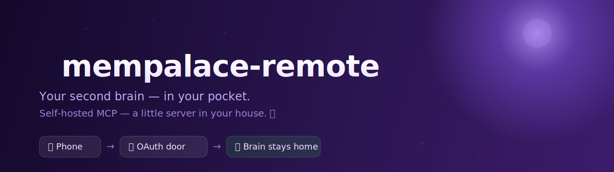

<p align="center">
  
</p>

<h1 align="center">mempalace-remote 🧠📱</h1>

<p align="center">
  <em>A guarded little door that lets the Claude app on your phone read your second brain —<br>while the brain itself never leaves the desk it lives on.</em>
</p>

<p align="center">
  
  
  
  
  
</p>

<p align="center">
  
  
  
</p>

---

Public **remote MCP** front-end for the local MemPalace, so the **Claude app
(phone)** can reach it as a custom connector. Runs **entirely on the desktop** —
the palace data never leaves it. Tailscale Funnel publishes it; no router ports,
no Cloudflare, no Hetzner. Just sunlight. ☀️

```
📱 Claude app → ☁️ Anthropic → 🔐 Tailscale Funnel (:8443) → 127.0.0.1:8789 (this) → 🧠 mempalace
```

It wraps `mempalace.mcp_server.handle_request` **without changing a line** and
puts a minimal OAuth 2.1 authorization server (metadata + dynamic client
registration + authorization-code + PKCE/S256 + refresh) in front. No third
party — the server is *both* the resource and its own authorizer. The human gate
is one passphrase at the login page. 🚪

## Setup 🚀

1. **Secrets** 🔑
   ```bash
   mkdir -p ~/.mempalace/remote
   cp env.example ~/.mempalace/remote/env
   chmod 600 ~/.mempalace/remote/env
   # edit ~/.mempalace/remote/env → set MEMPALACE_REMOTE_PASSPHRASE
   ```

2. **Run** (foreground test)
   ```bash
   ./run.sh
   ```
   or as a service:
   ```bash
   cp mempalace-remote.service ~/.config/systemd/user/
   systemctl --user daemon-reload
   systemctl --user enable --now mempalace-remote
   sudo loginctl enable-linger ivan   # survive logout/reboot
   ```

3. **Publish with Tailscale Funnel** on a dedicated port (`:443` is already used
   by an existing tailnet-only serve, so use `:8443`):
   ```bash
   sudo tailscale funnel --bg --https=8443 127.0.0.1:8789
   sudo tailscale funnel status
   ```
   If Funnel isn't enabled for the tailnet yet, the command prints an admin URL
   to grant the `funnel` node attribute (run as the tailnet owner).

4. **Add the connector** in the Claude app / claude.ai → Settings → Connectors →
   Add custom connector → URL:
   ```
   https://your-machine.your-tailnet.ts.net:8443/mcp
   ```
   Claude discovers OAuth, opens the login page → enter the passphrase → done.

## Notes 📝
- Calls to mempalace are serialized (ChromaDB + SQLite KG aren't concurrent-safe).
- OAuth tokens persist in `~/.mempalace/remote/oauth_state.json` (0600).
- This is **model A (tunnel)**: works while the desktop is awake. The local
  Claude Code auto-save hooks are untouched and keep writing the same palace.
- Backups run hourly (7-day rolling + off-site), and a second always-on box
  watches the public endpoint from the outside — because a machine can't report
  its own death. 🛰️

---

<p align="center"><sub>The datacenter is a house. The house runs on sunlight. Kardashev Type 1, one drawer at a time. ☀️🧠</sub></p>
